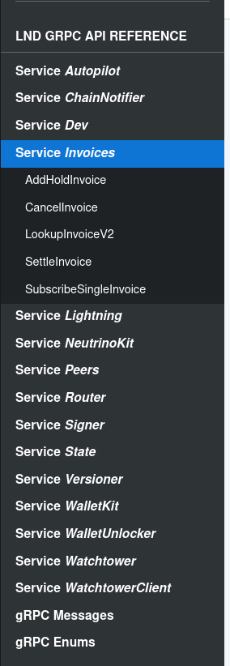

# Macabake
A tool for creating custom macaroons


# LND Config Environment Variables
Put these environment variables into your path
```
export CRED_PATH=/home/skorn/Documents/creds/kungmeow/lnd
export LND_CRED_PATH=/home/skorn/Documents/creds/kungmeow/lnd
export LND_NODE_IP=kungmeow.m.voltageapp.io
export LND_NODE_PORT=10009
```

This script expects there to be a valid `admin.macaroon` and a `tls.cert` file located at `CRED_PATH`/`LND_CRED_PATH`.

# Example

## Bake a custom macaroon
```
macabake bakemacaroon \
    --apis Lightning OpenChannel \
    --apis Lightning SubscribeChannelEvents \
    --apis Lightning ConnectPeer \
    --output_filename=mycustommacaroon.macaroon
```
The macaroon is saved into the same directory as `admin.macaroon`, which is at the `$CRED_PATH` environment variable.
The `--apis` flag can be passed multiple times, and is two strings: Subsystem API_name. The subsystems are listed on the LND docs website, like in the image below or using the command:

```macabake list-lnd-subsystems```

You can view which APIs are in each subsystem like so:

```macabake list-lnd-apis --subsystem WalletKit```

# LND Subsystems from LND Docs
Link to LND API Docs:

